<h2>Welcome!</h2>
<h4>Hi! This is my online tech resumé. On this page, I will post the different certifications and tech skills I have acquired. Hope you enjoy!</h4>

<h2><b>Technical Skills</b></h2>

  
<b>GitHub</b>

   
  
I completed the "First Day on Github" and "First Week on Github" Learning Paths. As a result of the training, I learned about the basic workflow and operations involved in utillizing Github to its full potential.
    Skills developed include:
  <ul>
    <li>Communicating Using Markdown</li>
    <li>Uploading a project to Github</li>
    <li>Customizing Github pages</li>
    <li>Utilizing pull requests</li>
    <li>Resolving merge conflicts</li>
    <li>Securing workflows</li>

  </ul>
  
  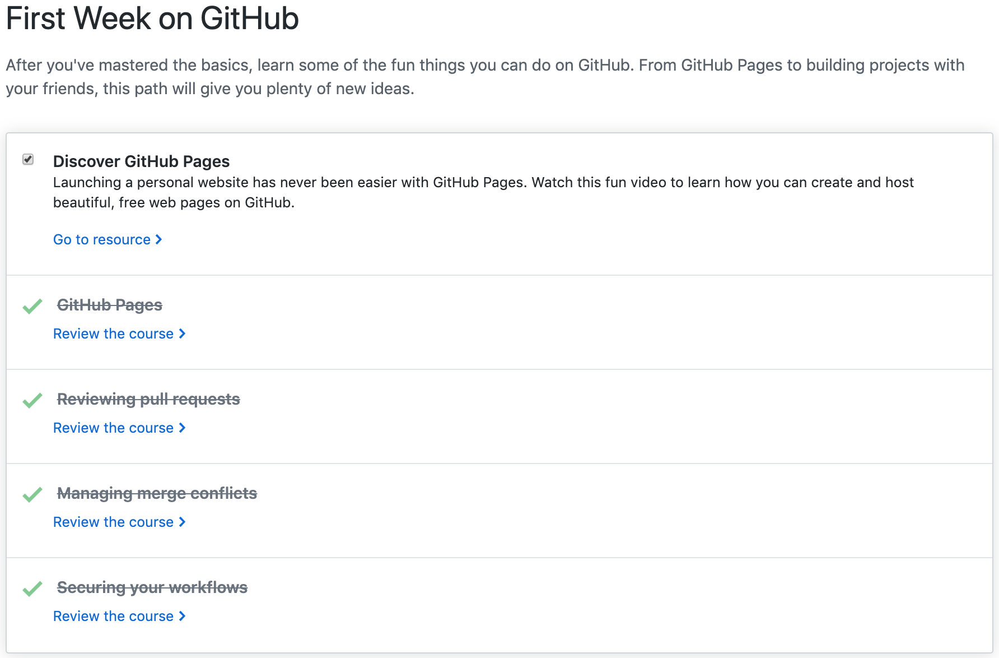
  

  
<b>Linux</b>

   
  
I completed the 16-hour LPI Linux Essentials course offered in Linux Academy. This course provided a broad overview of the functions available within Linux specifically utilizing the command line to accomplish a task. Some of the specific topics discussed within the course included:
  <ul>
    <li>Understanding command line basics</li>
    <li>Linux-embedded systems</li>
    <li>Using directories and listing files</li>
    <li>Archivig file using command line</li>
    <li>Searching and exracting data from files</li>
    <li>Understanding computer hardware</li>
    <li>Managing file permissions and ownership</li>

  </ul>
  

    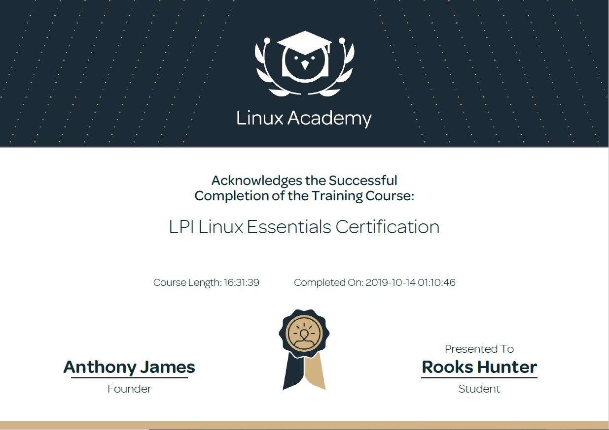

  
<b>PowerBI</b>

   
  
I auditted the <a href="https://www.edx.org/course/analyzing-visualizing-data-power-bi-4"> Analyzing and Visualizong Data with Power BI</a> course by edX. This course taught me the intricacies of PowerBI including how to utilize PowerBI for analytical purposes. Below is a list of specific skills taught in the course followed by a walkthrough of a personal dashboard I created.
    <ul>
    <li>Data Transformations</li>
    <li>Managing Data</li>
    <li>Optimizing Models</li>
    <li>Utilizing Data Visualizations</li>
    <li>Configuring Dashboards</li>

  

  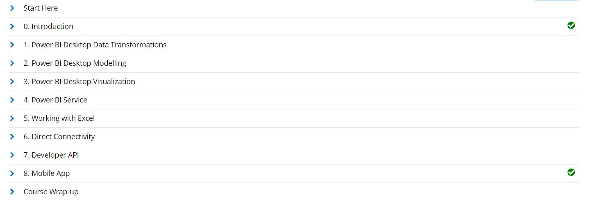
  </ul>
  Click the following link for walkthrough of my Power BI dashboard: <a href="https://youtu.be/xPzbK4cgHco">Rooks Hunter's Supplier Quality Analysis Dashboard</a>
  

  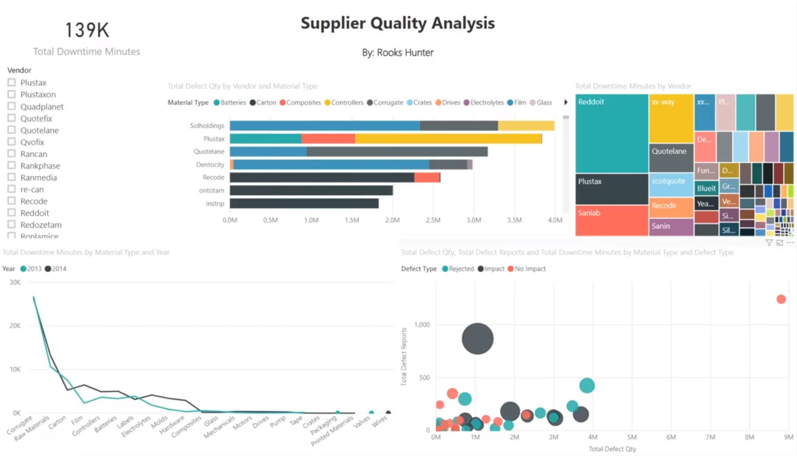

  
<b>VPN Configurations</b>

   
  
In this task I used Algo VPN to set up my personal Wireguard and IPSEC VPN. In order to run my Algo server, I ran it on my local system and let it set up a new virtual machine for me. I used Digital Ocean as my cloud hosting provider, and I created an Ubuntu virtual machine. After installng the Algo scripts and dependencies, I used Wireguard to configure my VPN.
   
   
    Below is a screen shot of three windows. The left two windows are pictures of <a href="ipleak.net">ipleak.net</a>. The far left is ipleak.net when Wireguard is deactivated. The middle window is the output displayed on ipleak.net when my Wireguard is activated. Lastly, the far right window is Digital Ocean, which contains my VPN IP address.
  

  <h2>AlgoVPN through Digital Ocean</h2>
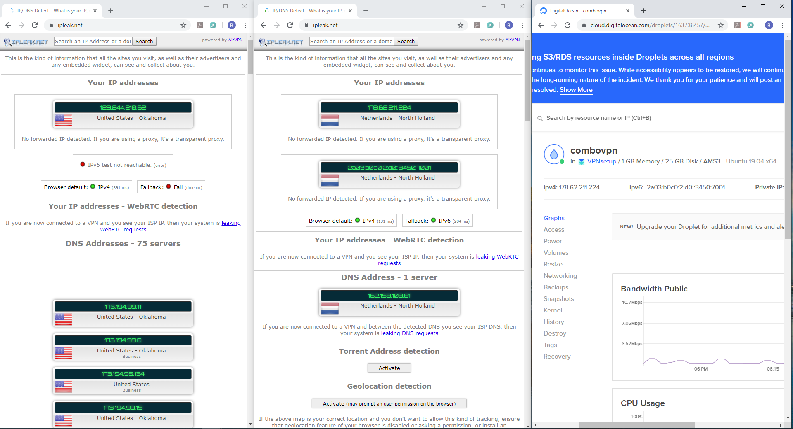
 
 
<h2>AlgoVPN through AWS EC2 instance</h2>

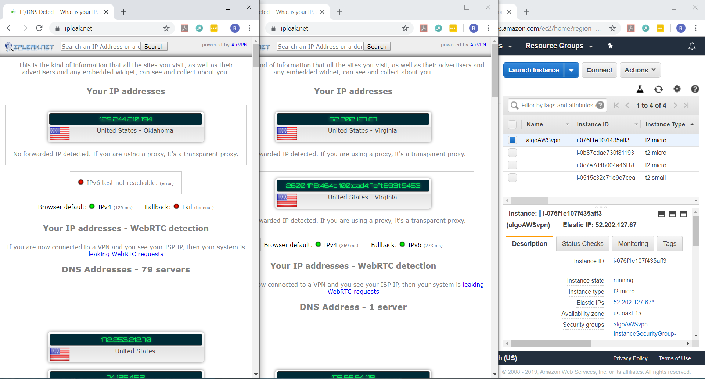
 
 
<h2>OpenVPN through AWS EC2 instance</h2>

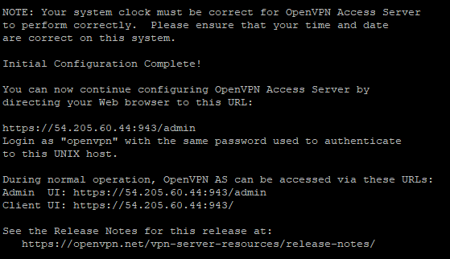
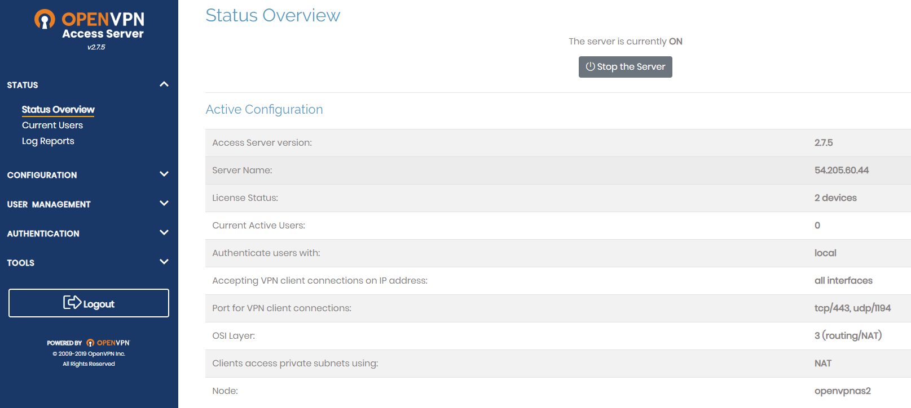

  
<b>PowerShell</b>

   
  
I completed the <a href="https://www.linkedin.com/learning/powershell-5-essential-training"> PowerShell 5 Essential Training</a> found on LinkedIn Learning. This course taught me the basic ins-and-outs of PowerShell along with how to use it to optimize management. More specifically, I learned how to discover commands using "Get-Help *<i>command</i>*", how to utilize "Get-Service", adding snappins for more cmdlets, dynamic importing of modules, comparing data using operators and "Where-Object", running script files and much more.  Below is a broader view of the topics covered during the training along with the certificate provided upon completion of the course:
  <ul>
    <li>Getting Ready for Powershell</li>
    <li>Discovery and Getting Help</li>
    <li>Extending Your Capabilities with Powershell</li>
    <li>Using the Power of the Pipeline</li>
    <li>Getting More out of Objects</li>
    <li>Scripts and Automation</li>
    <li>Scalable Management with Powershell Remoting</li>

  </ul>
  
 
  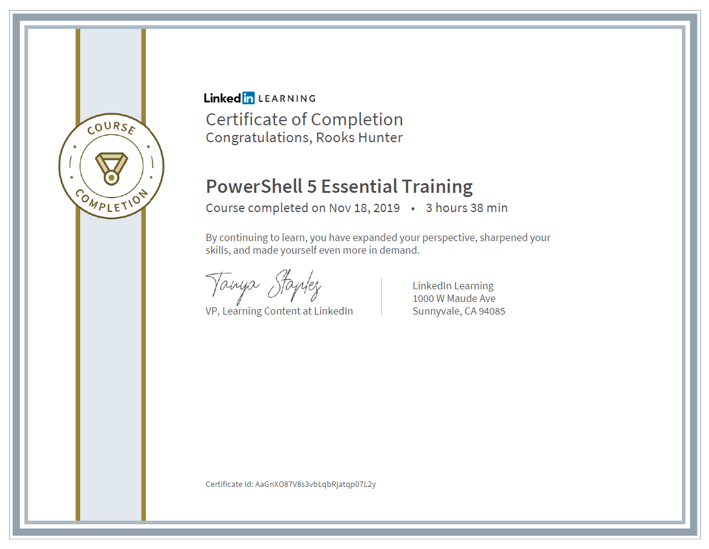

  
<b>AWS</b>

   
  
I completed the AWS Essentials course on Linux Academy. This course functioned as a guide for how to get started within AWS. Topics discussed included managing AWS access with users, groups and roles, networking services and connectivity, compute services, storage services, database services, loadbalancing, elasticity, scalability, and serverless compute. In order illustrate my understanding of the previous topics, I took part in the following hands-on labs:
  <ul>
    <li>Creating a basic function to shut down and EC2 instance</li>
    <li>Setting up an application load balancer with an auto scaling group and route 53</li>
    <li>Created an Amazon Aurora RDS database</li>
    <li>Created a basic Amazon S3 lifecycle policy</li>
    <li>Created Amazon S3 buckets, managing objects and enabling versioning</li>
    <li>Created a Linux EC2 instance in AWS and connect using SSH</li>
    <li>Created a basic VPC and associated components</li>
  </ul>
  

  
  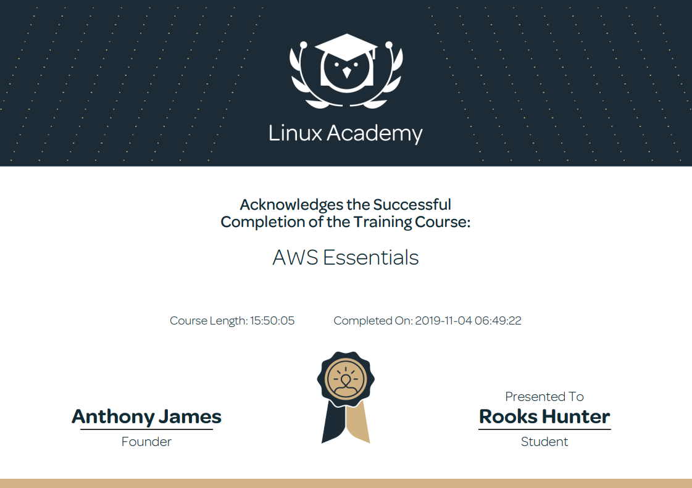
  

  

  
<b>Salesforce</b>

   
  
I went through the Admin Beginner Trail on Trailhead in order to introduce myself to Salesforce. Through the course I was able to learn a lot about how organizations can customize their customer relationship platforms. Some of the specific topics I learned were how to import and export data, use the schema builder for editing entities, create custom buttons and links and prompting user engagements.  The specific modules I covered within this Trail were:
  <ul>
    <li>Salesforce Platform Basics</li>
    <li>Data Modeling</li>
    <li>Data Management</li>
    <li>Lightning Experience Customization</li>
    <li>Salesforce Mobile App Customization</li>
    <li>User Engagement</li>
    <li>Reports and Dashboards for Lightning Experience</li>
  </ul>
  
 
  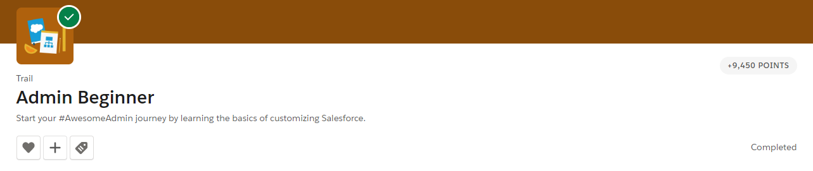

